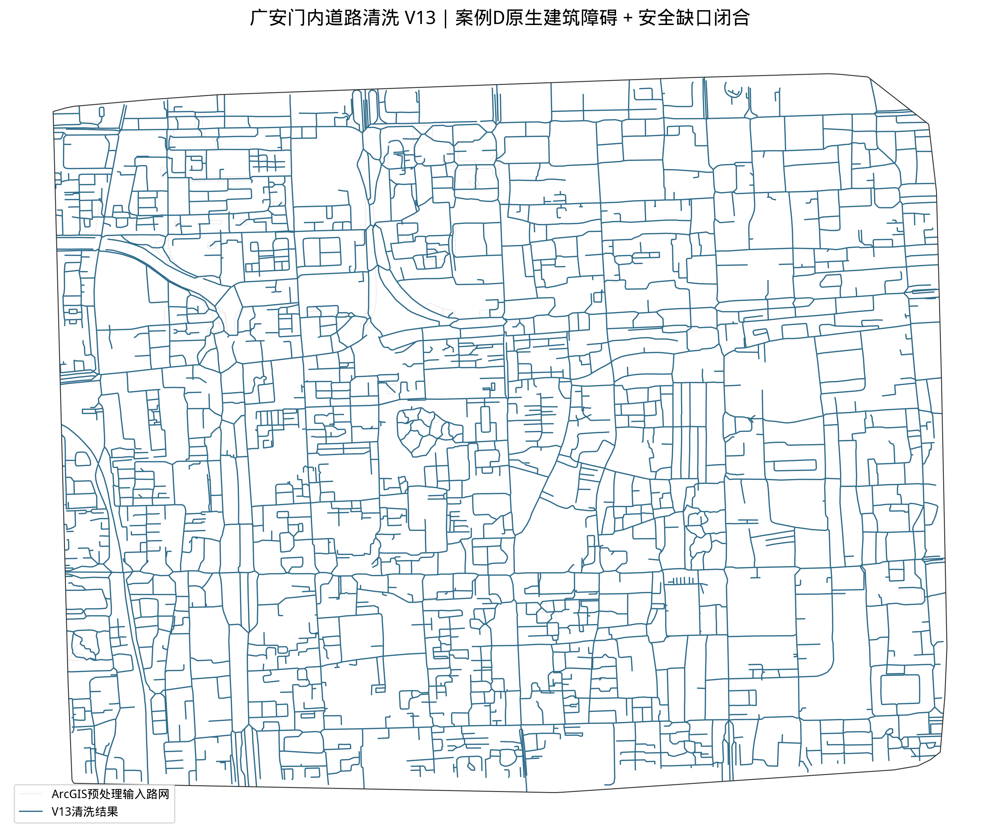
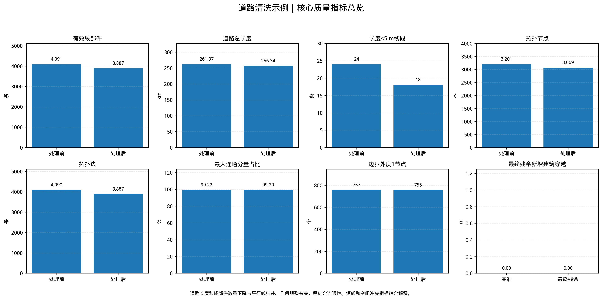
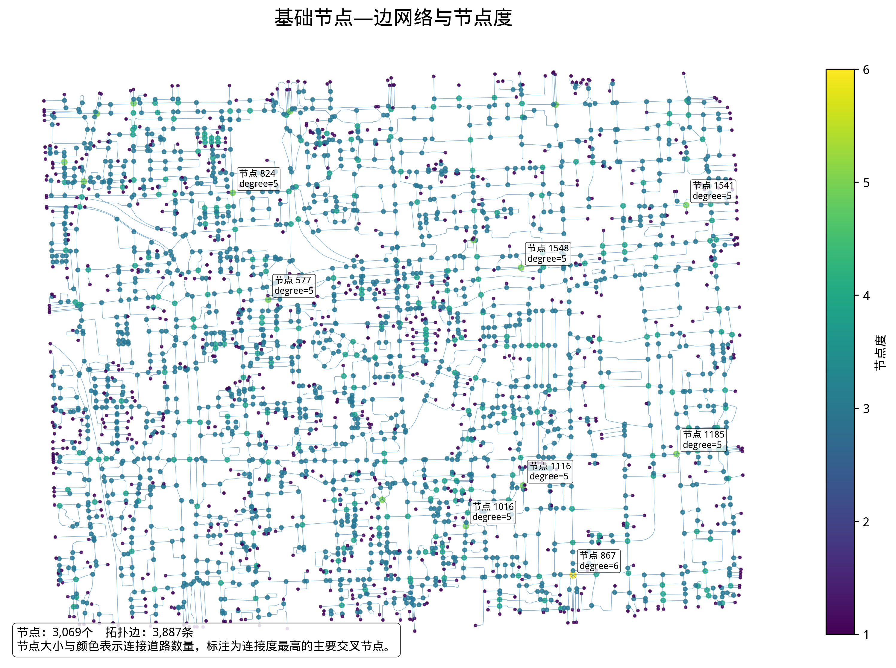

# 北京中心城区道路数据提取、自动清洗与质量控制

面向道路数据生产的 GIS / Python 自动化实践。

## 项目简介

本项目围绕北京中心城区道路数据，构建了一套从 GIS 基础预处理、分网格自动清洗，到质量审计和基础拓扑输出的处理流程。

项目重点处理道路几何数据中常见的冗余线、极短线、近邻节点、局部断裂、跨网格重复以及道路穿越建筑等问题，并通过阶段审计、异常回退和量化指标，降低自动清洗引入新错误的风险。

公开仓库主要展示以下三个环节：

1. 道路几何自动清洗；
2. 清洗前后质量验证；
3. 二维节点—边拓扑构建。

> 受数据访问方式及再分发权限限制，本仓库不公开在线地图矢量瓦片提取脚本、请求地址、访问凭证和完整原始数据。

---

## 项目流程

```text
在线矢量道路与建筑数据
        ↓
ArcGIS Pro：JSON 转要素
        ↓
Integrate（XY Tolerance = 0.5 m）
        ↓
Dissolve（不创建 multipart features）
        ↓
投影至 EPSG:4547
        ↓
GeoParquet 标准化
        ↓
Python 分网格道路清洗
        ↓
阶段质量审计与异常回退
        ↓
清洗前后量化验证
        ↓
基础节点—边拓扑输出
```

公开 Notebook 从完成 ArcGIS Pro 基础预处理后的道路数据开始运行，不包含网页端数据提取过程。

---

## 处理策略

完整项目采用以下主要参数：

| 处理环节 | 参数 |
|---|---:|
| 核心处理网格 | 2000 m |
| 网格计算缓冲区 | 800 m |
| 道路规整距离 | 10 m |
| 几何简化容差 | 0.35 m |
| 极短悬挂线阈值 | 20 m |
| 近邻节点整合距离 | 8 m |
| 道路延伸距离 | 15 m |
| 安全缺口修复距离 | 5 m |
| 建筑穿越审计容差 | 0.20 m |
| 坐标参考系统 | EPSG:4547 |

道路延伸和缺口修复受到建筑轮廓约束。每个关键处理阶段均检查是否引入新的建筑穿越；超过容差时，该阶段结果将被回退。

---

## 核心结果

以下结果来自完整项目范围，不是仓库中的小范围演示样例。

| 指标 | 清洗前 | 清洗后 | 变化 |
|---|---:|---:|---:|
| 有效线部件 | 6722 | 4091 | -39.1% |
| 道路总长度 | 367.17 km | 261.97 km | -28.6% |
| 长度不超过 5 m 的线段 | 185 | 24 | -161 |
| 二维拓扑节点 | 4765 | 3201 | -32.8% |
| 二维拓扑边 | 6722 | 4090 | -39.2% |
| 最大连通分量长度占比 | 99.44% | 99.22% | -0.22 个百分点 |
| 非边界悬挂节点数量 | 762 | 757 | -5 |
| 最终残余新增建筑穿越 | — | 0 m | 无新增穿越 |

分网格处理结果：

- 4 个计算网格全部成功；
- 处理失败网格为 0；
- 识别到 50 条原始缺口修复记录；
- 跨网格去重后得到 34 条唯一修复；
- 阶段审计阻止了 59.81 m 潜在新增建筑穿越；
- 最终残余新增建筑穿越为 0 m。

道路长度和线数量减少主要来自平行道路表达规整、线段合并和短线处理。数量下降本身不直接等同于质量提升，需要结合短线、连通性、建筑穿越和拓扑指标综合判断。

---

## 结果预览

### 道路清洗前后对比



### 量化质量验证



### 节点网络与节点度



---

## 仓库结构

```text
road-network-cleaning/
├── README.md
├── requirements.txt
│
├── 01_项目说明与数据准备/
│   ├── 01_完整处理流程图.png
│   ├── 02_数据准备说明.md
│   ├── 03_ArcGIS预处理参数.md
│   └── 04_字段说明.md
│
├── 02_精简版代码/
│   ├── 01_道路清洗示例.ipynb
│   ├── 02_质量验证示例.ipynb
│   └── 03_基础拓扑构建示例.ipynb
│
├── 03_小范围样例数据/
│   ├── boundary_sample.parquet
│   ├── streets_before_sample.parquet
│   └── buildings_sample.parquet
│
├── 04_示例输出/
│   ├── streets_cleaned_sample.parquet
│   ├── quality_comparison.csv
│   ├── process_control_metrics.csv
│   ├── quality_summary.csv
│   ├── network_nodes_sample.parquet
│   ├── network_edges_sample.parquet
│   ├── network_build_report.csv
│   └── figures/
│       ├── 01_道路清洗前后对比.png
│       ├── 02_量化质量验证.png
│       └── 03_节点网络与节点度.png
│
└── 05_完整作品集/
    └── 北京中心城区道路数据提取自动清洗与质量控制.pdf
```

---

## Notebook 说明

### 1. 道路清洗示例

`02_精简版代码/01_道路清洗示例.ipynb`

读取经过 ArcGIS Pro 基础预处理的小范围道路、建筑和边界数据，执行：

- 几何有效性检查；
- 道路线规范化；
- 冗余和极短线处理；
- 近邻节点整合；
- 建筑约束道路延伸；
- 安全缺口修复；
- 阶段质量审计；
- 跨网格结果去重；
- 任务状态和性能记录。

主要输出：

```text
streets_cleaned_sample.parquet
grid_status.csv
stage_audit.csv
close_gap_candidates.gpkg
performance.csv
```

### 2. 质量验证示例

`02_精简版代码/02_质量验证示例.ipynb`

对清洗前后道路进行统一验证，包括：

- 有效线部件和道路长度；
- 重复线与极短线；
- 二维拓扑节点和边；
- 连通分量；
- 非边界悬挂节点；
- 建筑穿越；
- 缺口修复记录；
- 运行状态和性能。

主要输出：

```text
quality_comparison.csv
process_control_metrics.csv
quality_summary.csv
```

### 3. 基础拓扑构建示例

`02_精简版代码/03_基础拓扑构建示例.ipynb`

将清洗后的标准化道路线转换为二维节点—边结构，输出：

```text
street_graph_sample.parquet
network_nodes_sample.parquet
network_edges_sample.parquet
nodes_graph_sample.parquet
network_build_report.csv
```

节点表示道路端点及二维相交点，边表示相邻节点之间的道路段。

---

## 运行顺序

三个 Notebook 按以下顺序运行：

```text
01_道路清洗示例.ipynb
        ↓
02_质量验证示例.ipynb
        ↓
03_基础拓扑构建示例.ipynb
```

安装依赖：

```bash
python -m pip install -r requirements.txt
```

随后在 Jupyter Lab 或 Jupyter Notebook 中打开：

```text
02_精简版代码/
```

公开样例默认采用较少的并行进程，便于普通个人电脑运行。完整项目使用更大的研究范围和更高的并行配置。

---

## 输入数据说明

### `streets_before_sample.parquet`

ArcGIS Pro 基础预处理后的道路输入，已经完成：

- JSON 转线要素；
- 坐标参考系统检查；
- Integrate，XY Tolerance 为 0.5 m；
- Dissolve；
- 小范围裁剪；
- GeoParquet 转换。

该文件不是最初提取的原始道路数据。

### `buildings_sample.parquet`

与道路样例范围一致的建筑轮廓，用于约束道路延伸、缺口修复和新增建筑穿越检查。

### `boundary_sample.parquet`

样例处理范围，用于裁剪结果，并区分内部悬挂节点与边界截断节点。

---

## 数据使用与公开范围

本仓库仅提供经过裁剪和整理的小范围演示数据。

以下内容不在仓库中公开：

- 在线矢量瓦片提取脚本；
- 浏览器 Console 操作代码；
- 服务请求地址和接口参数；
- Token、Cookie、请求头等访问凭证；
- 完整北京中心城区原始道路和建筑数据。

样例数据仅用于展示道路几何清洗、质量验证和基础拓扑构建方法。原始数据的使用和再分发应遵循相应数据服务条款。

---

## 当前能力边界

当前项目主要面向二维道路几何和基础拓扑数据生产，仍存在以下限制：

1. 部分源道路名称、等级和原始标识尚未在几何合并后完整回填；
2. 二维平面拓扑暂未识别桥梁、隧道及不同高程层级；
3. 尚未构建导航级道路方向、车道、通行权限和转向限制；
4. 任务审计仍以 Notebook、CSV 和空间文件为主要载体；
5. 尚未接入轨迹、街景、交通状态或用户反馈等多源更新证据。

因此，本项目输出不应直接视为导航级道路网络。

---

## 下一步工作

- 建立源道路 ID 映射和属性回填机制；
- 引入桥梁、隧道和 `layer` 信息，完善立体交通识别；
- 补充道路等级、方向、车道和通行权限；
- 构建道路段—节点—交叉口分层数据模型；
- 增加任务自动重试、人工审核状态和数据版本管理；
- 使用轨迹、影像和交通数据进行多源交叉验证；
- 探索 OCR 与视觉语言模型在道路标志和属性更新中的应用。

---

## 完整作品集

完整项目背景、处理案例、流程图和质量验证结果见：

[查看完整项目作品集](05_完整作品集/北京中心城区道路数据提取自动清洗与质量控制.pdf)


研究与求职方向：GIS、LBS、空间数据生产、地图数据质量与空间智能
